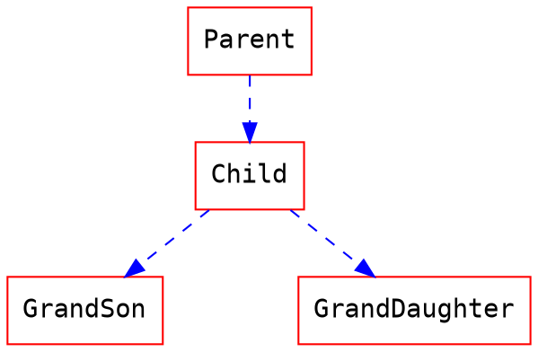

* content
{:toc}  


#### 一.继承

Java类通过 `extends`关键字来表示对父类的继承，如：

```java
public class Man extends Person{

}
public class Person {
	private int age;
	private String name;
	// getter and setter 
    // ...
}
```

**为什么需要继承？**

[详情 -> 点击](https://www.runoob.com/java/java-inheritance.html)

- 子类拥有父类非 private 的属性、方法。
- 子类可以拥有自己的属性和方法，即子类可以对父类进行扩展。
- 子类可以用自己的方式实现父类的方法。
- Java 的继承是单继承，但是可以多重继承，单继承就是一个子类只能继承一个父类，多重继承就是，例如 A 类继承 B 类，B 类继承 C 类，所以按照关系就是 C 类是 B 类的父类，B 类是 A 类的父类，这是 Java 继承区别于 C++ 继承的一个特性。
- 提高了类之间的耦合性（继承的缺点，耦合度高就会造成代码之间的联系越紧密，代码独立性越差）。

#### 二.多态

> 面向对象的三大特性：继承，封装，多态，从一定角度来看，封装和继承几乎都是为多态而准备的

##### 1.多态的定义

指允许不同类的对象对同一消息做出响应，即同一消息可以根据发送的对象的不同而采用多种不同的行为。 （发送消息就是函数调用）

##### 2.多态存在的三个必要条件

继承、重写、父类引用指向子类对象。

##### 3.多态的好处

- 可替换性。多态对已存在的代码具有可替换性。
- 可扩展性。增加新的子类不影响已存在类的多态性，继承性，以及其他特性的运行和操作，实际上新增功能更容易获得多态功能。
- 接口性。多态是超类通过方法签名。向子类提供一个共同接口，由子类来完善或者覆盖它而实现的。
- 灵活性。他在应用中提现了灵活多样的操作，提高了使用效率。
- 简化性。多态简化对应用软件的代码编写和修改过程，尤其是在处理大量对象的运算和操作时，这个特点尤为突出和重要。

##### 4.多态的实现方式

接口实现、继承父类进行方法的重写、同一个类中方法重载。

#### 三.代码讲解

**继承关系**



```java
/**
 * 父亲
 */
public class Parent {

    public String showGrandDau(GrandDaughter obj) {
        return ("在Parent类中，执行了showGrandDau方法");
    }

    public String showParent(Parent obj) {
        return ("在Parent类中，执行了showParent方法");
    }
}

/**
 * 孩子
 */
public class Child extends Parent {

    public String showChild(Child obj) {
        return ("B and B");
    }

    /**
     * 重写
     * 重写就是子类重写了父类的相同方法名，相同的形参，相同的返回类型的成员方法
     * @param obj
     * @return
     */
    @Override
    public String showParent(Parent obj){
        return ("在Child类中，执行了showParent方法");
    }
}

/**
 * 孙子
 */
public class GrandSon extends Child {
}

/**
 * 孙女
 */
public class GrandDaughter extends Child {
}


public class Lesson1Main {

    public static void main(String[] args) {
        // 一个parent的对象
        Parent parent = new Parent();
        // 指向Parent的child的对象，也就是可能具备多态的对象。
        Parent pChild = new Child();
        // 一个child对象
        Child child = new Child();
        // 孙子
        GrandSon grandSon = new GrandSon();
        // 孙女
        GrandDaughter grandDaughter = new GrandDaughter();
        System.out.println("1--" + parent.showParent(child));
        System.out.println("2--" + parent.showParent(grandSon));
        System.out.println("3--" + pChild.showGrandDau(grandDaughter));
        /**
         * pChild对象，说明该对象可能（实际已经符合了多态的三个条件）有多态
         * pChild对象，只能调用Parent类中存在的方法，即showGrandDau和showParent
         * 因为PChild实际的初始化时，是一个Child的对象，并且Child中重写了showParent，因此我们根据多态规则得知，执行Child类中的showParent
         */
        System.out.println("4--" + pChild.showParent(child));
        /**
         * 因为Parent类中没有showParent方法，接收的参数是GrandSon对象的
         * 因此我们可以将参数GrandSon向上转型为他的父类->Child后，逻辑同上
         */
        System.out.println("5--" + pChild.showParent(grandSon));
        // showGrandDau方法没有被重写，因此这个方法不涉及多态
        System.out.println("6--" + pChild.showGrandDau(grandDaughter));
        // 直接调用
        System.out.println("7--" + child.showChild(child));
        // 直接调用，只是参数向上转型了
        System.out.println("8--" + child.showParent(grandSon));  
        // child的对象，调用了父类的showGrandDau方法，因为子类继承了所有的父类的非私有方法
        System.out.println("9--" + child.showGrandDau(grandDaughter));
        // showParent 方法，子类和父类中都有，那么执行子类的方法（这不是多态）
        System.out.println("10--" + child.showParent(parent));
    }
}
```

**难度进阶×××**

如果可以看懂上面的代码，增加难度的方法，就是把所有的方法名字改成一个名字，比如show。

改完后，上面的10个输出，只有一个是难点，就是`5`和`6`的对比。

把所有的方法名字改成show后，再理解`5`和`6`，pChild调用同名方法show()，参数也很类似，都是Child的子类，一个GrandSon，一个GrandDaughter，但是结果为何不同。

_定义规则（正推）_

> 1.pChild只会调用父类的方法
>
> 2.先查找是否有完全匹配
>
> 3.如果有完全匹配，判断是否有被重写，有重写执行子类重写方法，无执行父类方法
>
> 如果没有完全匹配，参数向上转型为父类，继续执行2和3
>
> ...
>
> 如果最顶级的父类也没有符合要求的，那么编译报错。

_下面解释6的输出_

> 首先pChild是有多态属性的一个对象，调用showParent后会有多态，我们改方法名后，所有的方法都叫show，需要进一步的判断，参考下面的规则。
>
> 方法：show(grandDaughter)
>
> 1.pChild只会调用Parent中的方法。
>
> 2.先查找是否有完全匹配（方法名字+参数类型都一致）。因为规则1，所以只看Parent中的两个方法，存在完全匹配，并且没有被重写，直接输出

_再解释5的输出_

> pChild的解释参考上面
>
> 方法：show(grandSon)
>
> 1.pChild只会调用Parent中的方法。
>
> 2.先查找是否有完全匹配（方法名字+参数类型都一致）。因为规则1，所以只看Parent中的两个方法，没有完全匹配。
>
> 3.把参数向上转型，继续查找匹配，grandSon向上转型后为child，没有完全匹配。
>
> 4.继续把child向上转型，匹配，child向上转型为parent，找到匹配方法show(parent)
>
> 5.因为pChild存在多态，所以看看show(parent)是否被重写，重写后执行重写的方法，因为被重写了，所以执行Child中的show(parent)方法

**难度进阶×××××**

_定义规则（反推）_

> 1.首先查找子类中方法名和参数完全匹配的方法。
>
> 2.查找父类中方法名和参数完全匹配的方法。
>
> 3.查找子类中的方法名一样，参数向上转型后，是否有匹配的。
>
> 4.查找父类中方法名一样，参数向上转型，是否有匹配的。

_解释5的输出_

> 方法：show(grandSon)
>
> 条件1不符合
>
> 条件2不符合
>
> 条件3虽然有show(child)，但是show(child)在父类中没有定义，无法执行
>
> 条件4不符合
>
> 继续参数向上转型，child->parent,判断条件3，符合，输出

**小结**

正推和反推区别就是，一个先看父类，一个先看子类。

__先看父类，那么当找到符合条件后，判断是否有被重写，有重写执行子类，无执行父类；__

__先看子类，那么当找到符合条件后，判断该方法是否在父类中，有则执行子类方法，无继续向上查找__