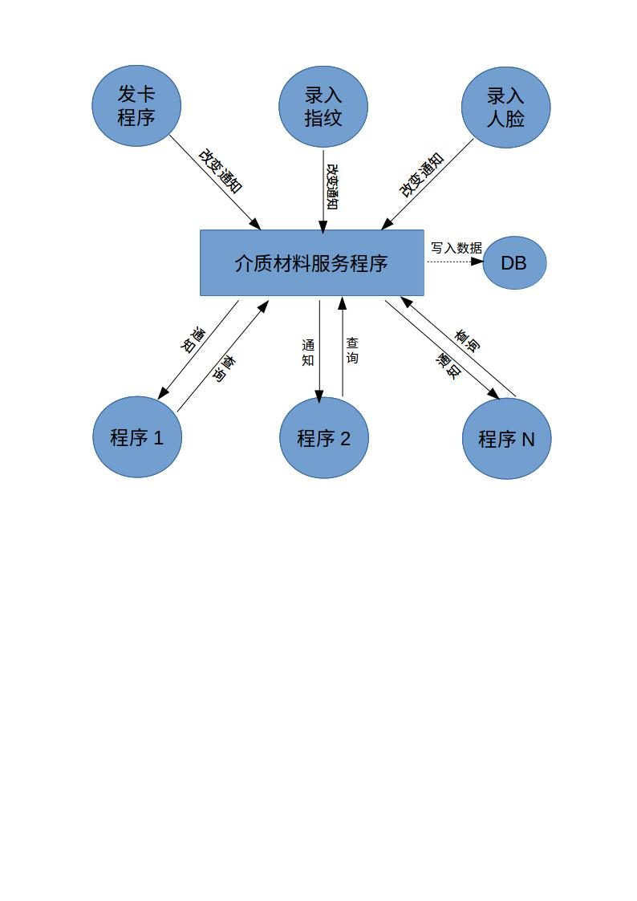

* content
{:toc}

>为了更好的降低服务间的耦合，现将已有的介质材料:卡片信息，指纹信息，人脸信息抽离，统一开发一个介质服务来进行管理，该服务只关心介质材料本身而不关注与之相关的业务逻辑，大大提升了代码的复用性。  

## 一.功能概述  
### 1.介质材料数据同步  
当介质材料所在的管理程序，对介质材料进行操作(增删改)时，介质材料管理程序通知本程序，本程序同步介质材料信息至本地数据库。  
### 2.提供‘订阅/通知’服务
本程序提供RESTFul风格的注册接口，允许第三方程序注册对关心介质材料的订阅，当本程序感知到介质材料发生变化时，推动变化信息至第三方注册者。  
### 3.提供查询接口  
本程序对外提供RESTFul风格的接口，对外提供介质材料的查询功能。  
## 二.流程图  


## 三.api详解

### 1. MQ订阅卡信息同步接口

#### 接口功能

> 通过订阅MQ来获取发卡程序发布的卡信息改变的信息  
该接口为本程序对信息提供程序的订阅，不对外提供服务。

#### 订阅所需参数

> exchange queue routing-key

#### 返回参数
```json
"opt": {
    "mode": "fragment", 
    "url": "/root/usr/card/file.text"
}, 
"data": [
    {
        "person_id": 123, 
        "card_serial": 456, 
        "card_number": "0A23B2F", 
        "meida_id": 148, 
        "is_main_card": 1, 
        "card_state": 0, 
        "loss_numb": 0, 
        "card_charge": 0, 
        "cardhold_serial": 1, 
        "is_card_replace": 0, 
        "end_date": "2037-12-31", 
        "card_add_date": "2017-11-01", 
        "pre_state": 0, 
        "loss_card_serial": 0, 
        "ver": 11520
    }
]
```

#### 返回参数说明

|参数|必选|类型|说明|
| - | - | - | - |
| mode |ture | string|同步模式：fragment:增量（以字符串传递） whole:全量（以文件方式传递） |
| url |false | boolean | 文件地址，全量时存在 |
| person_id | false | string | 人员ID |
| card_serial | false | int | 逻辑卡号 |
| card_number | false | string | 卡片序列号（物理卡号） |
| meida_id | false | int | 介质类型 |
| is_main_card | false | boolean | 主卡标志 |
| card_state | false | int | 卡片状态 |
| loss_numb | false | int | 卡片挂失次数 |
| card_charge | false | bigdecimal | 卡片押金 |
| cardhold_serial | false | int | 持卡序号 |
| is_card_replace | false | boolean | 挂失卡补卡标志 |
| end_date | false | date | 卡片有效日期 |
| card_add_date | false | date | 发卡日期 |
| pre_state | false | int | 卡片前状态，卡片挂失及卡片冻结使用 |
| loss_card_serial | false | int | 补发卡片对应的挂失卡逻辑卡号 |
| ver | false | int | 更新版本号 |
### 2. 注册监听接口

#### 接口功能

> 通过请求RESTFul风格的注册接口，进行介质改变订阅。

#### 请求参数

|参数|必选|类型|说明|
| - | - | - | - |
| registerType |ture | int | 注册类型：1(卡片)，2(指纹)，3(人脸) |
| isDetail |true | boolean | 是否要通知改变详情 |

#### 返回字段

|返回字段|字段类型|说明 |
| - | - | - | - |
| code | int |返回结果状态。1：正常；-1：错误。 |
| msg | string | 描述 |
| data | json | 返回数据 |
| data.exchange | string | mq的exchange名称 |
| data.queue | string | mq的queue名称 |
| data.routingKey | string | exchange的routingKey |

```json
"data": {
    "exchange": "exchange_name", 
    "queue": "queue_name", 
    "routingKey": "routingKey"
}
```

#### 接口地址

> 地址：[http://localhost:8080/MaterialService/v1/mq/register](http://localhost:8080/MaterialService/v1/mq/register)

### 3. 订阅MQ通知接口

#### 接口功能

> 当第三方程序执行了注册接口，获取到exchange queue routingKey后，可以自主实现对MQ的订阅，该接口推送给订阅者消息。

#### 订阅所需参数

|参数|必选|类型|说明|
| - | - | - | - |
| exchange | string | int | mq所需的exchange名称 |
| queue | ture | string | mq的queue名称 |
| routingKey | ture | string | exchange的routingkey标识 |

#### 返回参数
> 根据订阅类型，返回参数不同  

```json
{
    "code":1,
    "msg":"信息发生改变",
    "mode":1,
    "data.basicAccNo":3311,
    "data.cardNo":123,
    "data.fingerNo":123,
    "timestamp":"2017-01-12 12:00:00"
}
```
#### 返回参数说明

**返回明细为false时参考下表，所有介质通用**
|参数|必选|类型|说明|
| - | - | - | - |
| code | ture | int | 返回代码。1(卡片发生改变),2(指纹改变)，3(人脸改变) |
| msg | ture | string | 描述 |
| mode | ture | int | 1(新增)，2(更新) |
| data.basicAccNo | ture | int | 基础账户编号 |
| data.cardNo | false | int | 卡号 |
| data.fingerNo | false | int | 手指编号 0-9 |
| timestamp | ture | timestamp | 操作时间的时间戳 |

#### 订阅类型为卡片，isDetail 为true时  
|参数|必选|类型|说明|
| - | - | - | - |
| code | ture | int | 返回代码。1(卡片发生改变),2(指纹改变)，3(人脸改变) |
| msg | ture | string | 描述 |
| mode | ture | int | 1(新增)，2(更新) |
| data.basicAccNo | ture | int | 基础账户编号 |
| data.cardNo | false | int | 卡号 |
| url |false | boolean | 文件地址 |
| cardPyhsicalNo | false | string | 逻辑卡号 |
| cardTypeNo | false | int | 介质类型 |
| isMaster | false | boolean | 主卡标志。0为主卡 1为副卡 2 为其他 ，默认为0 |
| cardStatus | false | int | 卡状态。0(正常),1(挂失),2(已退卡),3(临时卡),4(发卡中),5(坏卡),6(升级中),7(补卡中) |
| cardCharge | false | bigdecimal | 卡片押金 |
| cardValidTime | false | date | 卡片有效日期 |
| insertedDt | false | date | 发卡日期 |
| ver | false | int | 更新版本号 |

#### 订阅类型为指纹,isDetail 为true时

|参数|必选|类型|说明|
| - | - | - | - |
| code | ture | int | 返回代码。1(卡片发生改变),2(指纹改变)，3(人脸改变) |
| msg | ture | string | 描述 |
| mode | ture | int | 1(新增)，2(更新) |
| data.basicAccNo | ture | int | 基础账户编号 |
| data.fingerNo | false | int | 手指编号 0-9 |
| data.fingerData | false | blob | 指纹数据 |
| data.fingerStoreName | false | string | 指纹存储文件名 |
| data.fingerStoreType | false | string | 指纹存储类型 |
| data.fingerStorePath | false | string | 指纹存储路径 |
| data.isDeleted | false | boolean | 是否删除 |
| data.insertedDt | false | date | 插入时间 |
| data.insertedBy | false | string | 插入人 |
| data.updatedDt | false | date | 更新时间 |
| data.updatedBy | false | string | 更新人 |

#### 订阅类型为人脸，isDetail 为true时

|参数|必选|类型|说明|
| - | - | - | - |
| code | ture | int | 返回代码。1(卡片发生改变),2(指纹改变)，3(人脸改变) |
| msg | ture | string | 描述 |
| mode | ture | int | 1(新增)，2(更新) |
| data.basicAccNo | ture | int | 基础账户编号 |
| data.faceData | false | blob | 人脸数据 |
| data.faceStoreName | false | string | 人脸数据存储文件名 |
| data.faceStoreType | false | string | 人脸数据存储类型 |
| data.faceStorePath | false | string | 人脸数据存储路径 |
| data.isDeleted | false | boolean | 是否删除 |
| data.insertedDt | false | date | 插入时间 |
| data.insertedBy | false | string | 插入人 |
| data.updatedDt | false | date | 更新时间 |
| data.updatedBy | false | string | 更新人 |

### 4. 卡片查询接口

#### 接口功能

> 提供接口查询，查询卡片详细信息

#### 支持格式

> JSON

#### HTTP请求方式

> GET

#### 请求参数

|参数|必选|类型|说明|
| - | - | - | - |
| cardNo |ture | int | 要查询的卡号 |

#### 返回字段

|返回字段|字段类型|说明 |
| - | - | - |
| code | int |返回结果状态。1：成功；-1：错误。 |
| msg | string | 描述 |
| data | json | 返回数据 |
| data.cardTypeNo | int | 卡类型编号 |
| data.cardNo | int | 卡号 |
| data.cardPhysicalNo | int | 物理卡号 |
| data.basicAccNo | int | 基础账户编号 |
| data.isMaster | int | 0为主卡 1为副卡 2 为其他 ，默认为0 |
| data.cardStatus | string | 卡状态。0(正常),1(挂失),2(已退卡),3(临时卡),4(发卡中),5(坏卡),6(升级中),7(补卡中) |
| data.cardValidTime | date | 卡有效期 |
| data.cardCharge | bigDecimal | 卡押金 |
| data.otherInfo | jsonb | 其他信息 |
| data.isDeleted | boolean | 是否删除 |
| data.insertedDt | date | 插入时间 |
| data.insertedBy | string | 插入人 |
| data.updatedDt | date | 更新时间 |
| data.updatedBy | string | 更新人 |


#### 接口示例

> 地址：[http://localhost:8080/MaterialService/v1/material/findCardEntity](http://localhost:8080/MaterialService/v1/material/findCardEntity)

### 5. 指纹查询接口

#### 接口功能

> 提供接口查询，查询指纹详细信息

#### 支持格式

> JSON

#### HTTP请求方式

> GET

#### 请求参数

|参数|必选|类型|说明|
| - | - | - | - |
| basicAccNo | ture | int | 基础账户编号 |
| fingerNo | false | int | 手指编号 0-9，多个以","分割 |

#### 返回字段

|参数|必选|类型|说明|
| - | - | - | - |
| code | ture | int |返回结果状态。1：成功；-1：错误。 |
| msg | ture | string | 描述 |
| data | ture | json | 返回数据 |
| data.list.basicAccNo | ture | int | 基础账户编号 |
| data.list.fingerNo | false | int | 手指编号 0-9 |
| data.list.fingerData | false | blob | 指纹数据 |
| data.list.fingerStoreName | false | string | 指纹存储文件名 |
| data.list.fingerStoreType | false | string | 指纹存储类型 |
| data.list.fingerStorePath | false | string | 指纹存储路径 |
| data.list.isDeleted | false | boolean | 是否删除 |
| data.list.insertedDt | false | date | 插入时间 |
| data.list.insertedBy | false | string | 插入人 |
| data.list.updatedDt | false | date | 更新时间 |
| data.list.updatedBy | false | string | 更新人 |

#### 接口示例

> 地址：[http://localhost:8080/MaterialService/v1/material/findFingerList](http://localhost:8080/MaterialService/v1/material/findFingerList)

### 6. 人脸查询接口

#### 接口功能

> 提供接口查询，查询人脸详细信息

#### 支持格式

> JSON

#### HTTP请求方式

> GET

#### 请求参数

|参数|必选|类型|说明|
| - | - | - | - |
| basicAccNo | ture | int | 基础账户编号 |

#### 返回字段

|参数|必选|类型|说明|
| - | - | - | - |
| code | ture | int |返回结果状态。1：成功；-1：错误。 |
| msg | ture | string | 描述 |
| data | ture | json | 返回数据 |
| data.basicAccNo | ture | int | 基础账户编号 |
| data.faceData | false | blob | 人脸数据 |
| data.faceStoreName | false | string | 人脸数据存储文件名 |
| data.faceStoreType | false | string | 人脸数据存储类型 |
| data.faceStorePath | false | string | 人脸数据存储路径 |
| data.isDeleted | false | boolean | 是否删除 |
| data.insertedDt | false | date | 插入时间 |
| data.insertedBy | false | string | 插入人 |
| data.updatedDt | false | date | 更新时间 |
| data.updatedBy | false | string | 更新人 |

#### 接口示例

> 地址：[http://localhost:8080/MaterialService/v1/material/findFaceEntity](http://localhost:8080/MaterialService/v1/material/findFaceEntity)
